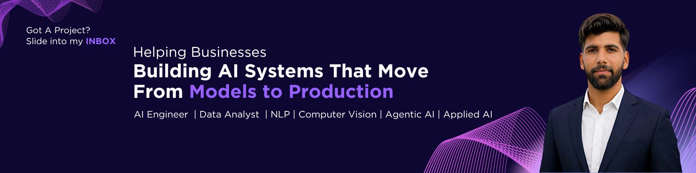

# 👋 Hi, I'm Qadeer Ahmed

I'm an **AI/ML Engineer** with hands-on experience building and deploying **AI-powered applications, automation solutions, and production-ready systems**. My experience spans **NLP, Computer Vision, Agentic AI, LLMs, RAG, AI automation, full-stack development, API integration, and cloud deployment**.

💻 **Check out my Portfolio:** [qadeerahmed884.vercel.app](https://qadeerahmed884.vercel.app/)

---

## 🧑‍💻 About Me

* 🎓 **Education:** BS in Information Technology, University of Chakwal (2020–2024), CGPA: 3.39/4.0
* 💼 **Current Role:** AI Engineer at **WeWebWizards**, working remotely on AI-powered applications, enterprise software, and automation solutions.
* 🔭 **Current Focus:** Building **Agentic AI and Applied AI solutions**, with a focus on LLMs, RAG, AI automation, full-stack applications, API development, and production deployment.
* 🧠 **Core Areas:** NLP, Large Language Models, RAG, Computer Vision, Agentic AI, AI Automation, Full-Stack Development, REST API Development, and Cloud Deployment.
* 🚀 **Recent Work:** Enterprise Audit Management System (AMS) and IT Report Automation for MSP environments.
* 🤝 **Open to:** AI/ML Engineering, Applied AI, Generative AI, AI Automation, and Software Engineering opportunities.

---

## 🛠️ Technologies & Tools

### 👨‍💻 Programming Languages

  
  
  
  

### 🤖 AI & Machine Learning

  
  
  
  

### 🧠 NLP, LLMs & Applied AI

  
  
  
  
  
  
  
  
  

### 👁️ Computer Vision

  
  
  
  
  

### 🌐 Full-Stack Development

  
  
  
  
  
  

### ⚡ Backend & API Development

  
  
  
  

### 🗄️ Databases & Cloud

  
  
  
  
  
  
  

### 🔄 Automation & Integrations

  
  
  
  

### 🚀 DevOps & Deployment

  
  
  
  
  

---

## 🚀 Professional Experience

### AI Engineer (Remote)

**WeWebWizards** | Remote
**August 2025 – Present**

* Collaborated on the design and development of full-stack web applications for enterprise clients.
* Engineered and maintained backend services and APIs supporting automated reporting workflows.
* Integrated AI/ML capabilities into production systems to support business automation.
* Improved workflow efficiency through automation and process optimization.
* Managed the application lifecycle from development through production deployment.

### AI/ML Developer

**Gelecek** | Rawalpindi, Pakistan
**December 2024 – August 2025**

* Designed a best-shot image selector using MediaPipe, YOLO, and DeepFace for facial pose and quality filtering with real-time camera integration.
* Conducted data analysis on user profiles and engagement metrics and designed interactive dashboards for reporting.
* Engineered and deployed an AI-powered Job Finder Web App using FastAPI and LLMs to extract insights from job listings.
* Implemented text summarization and chatbot/NLP modules for dynamic user interaction and knowledge extraction.

### AI/ML Professional Trainee

**Innovista Rawal** | Rawalpindi, Pakistan
**November 2024 – April 2025**

* Gained practical experience in Machine Learning, Deep Learning, NLP, Computer Vision, MLOps, and AWS through market-driven AI projects.
* Applied AI/ML techniques to practical use cases and production-oriented workflows.

### AI/ML Intern

**Bits Phile** | Chakwal, Pakistan
**August 2024 – October 2024**

* Focused on exploratory data analysis, model development, evaluation, optimization, and data visualization.
* Applied data preprocessing and feature engineering to improve model performance.

---

## 🔥 Featured Projects

### 🏢 Audit Management System (AMS)

**Enterprise SaaS Platform**

* Engineered a multi-tenant audit management SaaS platform using **React, TypeScript, Node.js, Express.js, and Supabase/PostgreSQL**.
* Implemented role-based audit workflows with dashboards, standards management, client management, and user administration.
* Incorporated **OpenAI GPT** for AI-powered summaries and report generation.
* Implemented PDF and report export functionality for client deliverables.
* Used **Vite and Tailwind CSS** for modern frontend development.
* Hosted the application on **DigitalOcean using Docker and CI/CD** for builds and releases.
* Configured **AWS database backups** to support disaster recovery.

### 📊 IT Report Automation for MSP

* Streamlined monthly IT compliance reporting for an MSP across **10+ platforms**, including Datto, Autotask, SentinelOne, UniFi, and Spin.ai.
* Created a **Streamlit-based pipeline** integrating data from **11 APIs** and generating professional DOCX reports in under **15 minutes**.
* Leveraged **OpenAI GPT** for intelligent risk summaries and executive insights.
* Used **python-docx and Word COM automation** for professional document formatting.
* Reduced report generation time by **90%**, eliminated manual copy-paste errors, and enabled reporting for **20+ clients** without additional headcount.

### 🤖 Interview.ai – AI Hiring Platform

* Implemented a full-stack AI hiring platform that streamlines end-to-end candidate screening.
* Integrated CV parsing, interview scheduling, AI question generation, response evaluation, personality and technical assessments, and final reporting.
* **Tech Stack:** Next.js, FastAPI, Python, SQLite, LLMs.
* Reduced HR workload and shortlisting time by approximately **90%** through automated assessments and reporting.

### 💬 Conversational RAG Chatbot

* Built a **Retrieval-Augmented Generation (RAG)** chatbot providing context-aware responses from custom knowledge sources.
* Used **LangChain, Ollama, Grok, ChromaDB, Pinecone, and FastAPI**.
* Deployed the backend on **Railway**.
* Improved information retrieval and reduced hallucinations for enterprise use cases.

### 👁️ Object Detection – YOLOv8

* Created a real-time object detection application using **YOLOv8** fine-tuned on a custom-labeled dataset.
* Used **CVAT and Roboflow** for dataset preparation and annotation.
* Developed a **Flask API** backend for model inference.
* Demonstrated applied deep learning for real-time visual data processing.

### 🔎 AI Job Finder

* Developed an AI-powered job search application using **FastAPI and LLMs**.
* Extracted skills, experience, and relevant information from job listings.
* Provided structured job insights and recommendations through REST APIs.

### 📌 Additional Projects

* **Plant Classification:** CNN-based image classification for plant species identification.
* **Fruit Detection:** YOLO-based real-time object detection pipeline.
* **Whisper Audio Translation:** Audio-to-text translation using Whisper and Streamlit.
* **Text Summarization:** NLP-based summarization solutions for unstructured text.
* **Custom Chatbots:** Domain-specific chatbot solutions using LLM and RAG technologies.

---

## 💡 Core Expertise

* Artificial Intelligence
* Machine Learning
* Deep Learning
* Applied AI
* Agentic AI
* Generative AI
* Large Language Models (LLMs)
* Natural Language Processing (NLP)
* Retrieval-Augmented Generation (RAG)
* Computer Vision
* AI Automation
* Full-Stack Development
* REST API Development
* Data Analysis
* Model Deployment
* Cloud Deployment
* Enterprise SaaS Development

## 🌱 Currently Learning

* Advanced Agentic AI and Applied AI systems
* Production-ready RAG and LLM applications
* AI automation workflows
* MLOps and CI/CD for AI systems
* Scalable cloud deployment
* Advanced Computer Vision techniques

---

## 📫 Connect With Me

  
  
  
  

---

⭐ Feel free to explore my repositories and projects. I'm open to opportunities in **AI/ML Engineering, Applied AI, Agentic AI, Generative AI, AI Automation, and Software Engineering**.
